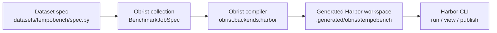

# Tempo Bench

Tempo Bench is packaged as a benchmark collection on top of Obrist. Obrist is a
small compiler over Harbor: authors edit typed Python specs, and Obrist emits a
disposable Harbor workspace.

## Layout

```text
obrist/
  dsl/
  compiler/
  backends/harbor/
  cli.py
datasets/
  tempobench/
    collections.py
    spec.py
    solutions/
    shared/
  mppbench/
    README.md
tests/
```

`datasets/tempobench/spec.py` is the single source of truth for
Tempo benchmark cases, profiles, prompts, env, and criteria patterns.
`datasets/tempobench/solutions` contains local oracle solution
directories that Obrist copies into generated tasks.
`datasets/tempobench/shared` contains reusable Docker,
RewardKit, and verifier assets. Obrist materializes the shared assets into each
generated Harbor task at compile time. Generated Harbor workspaces are written
to `.generated/`.

`datasets/tempobench/collections.py` is intentionally small. It
wraps the single `BenchmarkJobSpec` with Obrist's standard collection builder.

## Obrist And Harbor

Obrist is an authoring and compile layer. Harbor is the runtime. You edit typed
Python specs in `datasets/*`, then Obrist compiles those specs into the concrete
Harbor task tree that Harbor already knows how to run.



The generated Harbor workspace is disposable. Do not edit files under
`.generated/`; change the dataset spec, shared assets, templates, or solutions
instead, then compile again.

## Concept Mapping

| Obrist concept | Authoring location | Compiled Harbor primitive |
| --- | --- | --- |
| `BenchmarkJobSpec` | `datasets/<name>/spec.py` | Dataset, job config, generated task directories |
| `ProfileSpec` | `TEMPO_PROFILES` | Task variants such as `*-docs` and `*-mcp` |
| `TaskCaseSpec` | `TEMPO_CASES` | One or more Harbor task directories after profile expansion |
| `SourcePatternSpec` | `TaskCaseSpec.source_patterns` | RewardKit criteria in `tests/correctness/criteria.py` |
| `EnvironmentDefaults` plus task/profile env | `TEMPO_COMMON_ENV`, case env, profile env | `[environment]` and `[environment.env]` in `task.toml` |
| `SolutionSpec` | `datasets/tempobench/solutions/<case>/` | Generated `solution/` oracle files |
| `SharedAssetSpec` | `TEMPO_SHARED_ASSETS` | Copied Docker, verifier, RewardKit, and test assets |
| `HarborTemplateOverrides` | `datasets/tempobench/templates/*.j2` | Dataset overrides for generated Harbor files |
| Obrist Harbor templates | `obrist/backends/harbor/templates/` | Generic `task.toml`, `job.yaml`, `dataset.toml`, instructions |

## Compile Output

`uv run obrist compile tempobench` writes:

```text
.generated/obrist/tempobench/
  manifest.json
  job.yaml
  shared/
  tasks/
    dataset.toml
    <case>-<profile>/
      task.toml
      instruction.md
      environment/
      solution/
      tests/
```

Obrist controls compile-time shape:

- which tasks exist
- profile expansion
- generated prompts and task metadata
- environment variables and resource defaults
- copied shared assets
- generated RewardKit criteria
- local oracle solution files

Harbor controls runtime behavior after compile:

- running agents and oracle baselines
- Docker execution
- verifier execution
- job storage under `jobs/`
- viewer, publishing, and registry workflows

## Workflow

Install Python dependencies and tools through `uv`.

```bash
uv tool install harbor
uv tool install harbor-rewardkit==0.1.7
```

Compile the packaged benchmark once:

```bash
make compile
```

The same workflow is available through the Obrist CLI:

```bash
uv run obrist compile tempobench
```

Run local checks:

```bash
make check
```

Python style is enforced with Ruff and mypy. The codebase follows the practical
shape of PEP 8 and the Google Python Style Guide: typed public interfaces,
absolute imports, focused modules, and useful docstrings where APIs are public.

Format Python sources:

```bash
make format
```

## Make Targets

- `make compile`: compile `tempobench` through Obrist.
- `make format`: auto-format Python sources with Ruff.
- `make check`: run Ruff, asset syntax checks, unit tests, and mypy.
- `make clean`: remove generated local artifacts.

After compile, use Harbor directly from `.generated/obrist/tempobench` for run,
view, publish, or other Harbor workflows. Obrist deliberately does not wrap those
flows.

## Adding Tasks

Add or edit task cases in:

```text
datasets/tempobench/spec.py
```

Most new tasks need three pieces:

1. Add a `TaskCaseSpec` to `TEMPO_CASES`.
2. Add oracle source under:

```text
datasets/tempobench/solutions/<case-slug>/
```

3. Add verifier support under `datasets/tempobench/shared/` when the existing
   verifier cases do not cover the new behavior.

`TaskCaseSpec` is the high-level task contract. It defines the case slug, prompt,
requirements, fixture env, source-pattern checks, verifier case, and oracle
solution directory. Each `ProfileSpec` expands that case into a generated Harbor
task. For the current Tempo profiles, one case becomes:

```text
tempo/<case-slug>-docs
tempo/<case-slug>-mcp
```

Use `SharedAssetSpec` only for reusable files that every generated task should
receive. Use `HarborTemplateOverrides` when a dataset needs to override a generic
Obrist Harbor template. Override templates extend the packaged parent template:

```jinja2


rk.my_dataset_check()

```

Every packaged Harbor template supports this inheritance shape through a
top-level `content` block; some templates also expose narrower blocks such as
`imports` and `criteria`.

Then run:

```bash
make compile
make check
```
