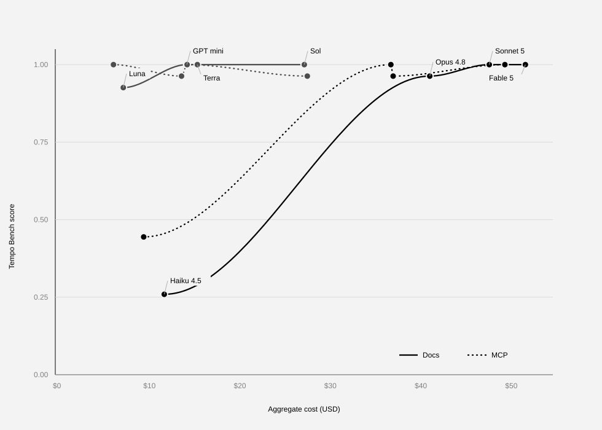
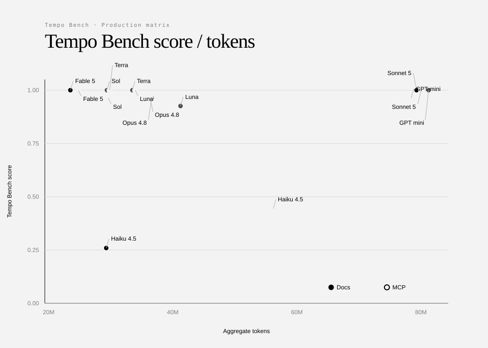
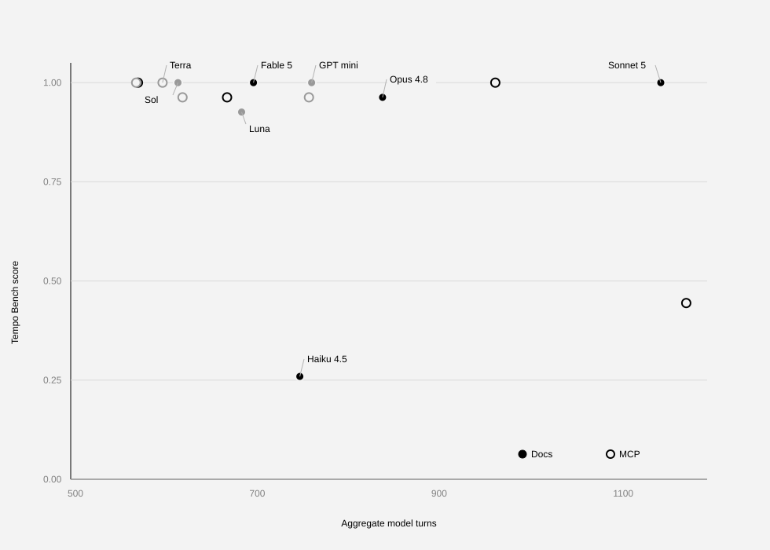

# Tempo Bench production model matrix — 2026-07-16

## Overview

Comparison of eight Claude and GPT models across `tempo-bench` to establish an
initial offline baseline.

Each suite ran pass@3 over a suite of nine tasks, with either access to Tempo docs (docs) or Tempo docs + an MCP (MCP).

| Field | Docs | MCP |
| --- | ---: | ---: |
| Benchmark | `tempo/tempo-bench-v1` | `tempo/tempo-bench-v1` |
| Harbor Hub job | [a1db301d](https://hub.harborframework.com/jobs/a1db301d-af4b-4fe7-9976-bd7e98939d66) | [dac00a5f](https://hub.harborframework.com/jobs/dac00a5f-56f9-45e8-a8be-f3425e0ae4eb) |
| Git revision | `d6384eb41c10ccf5e3d57eed6db6dbe29999898e` | `45d044ef548731926fed76efe17895bb93ecbde7` |
| Trials | 216 | 216 |
| Total cost | $218.66 | $196.72 |
| Total tokens | 358.99M | 374.19M |
| Total model turns | 6,117 | 5,948 |

## Score vs. cost



## Score vs. tokens



## Score vs. turns



## Result

Across 216 trials per access mode, the MCP configuration completed five more
correct trials than Docs (198 vs. 193). Its mean Tempo Bench score was 0.917,
up 2.3 percentage points from 0.894, while aggregate cost fell 10.0% ($196.72
vs. $218.66). The gain did not come from doing more agent work: MCP used 4.2%
more tokens but 2.8% fewer model turns.

Within this matrix, GPT 5.6 Luna with MCP is the clear score/cost frontier: it
is the only configuration with a perfect score at $6.43. Every other measured
configuration costs more and scores no higher. Nine of the 16 configurations
reach a perfect score, so among ceiling-level results, cost is the meaningful
separator.

## The MCP result is concentrated in Claude

The aggregate improvement is not uniform across model families. Claude gains
4.6 percentage points with MCP, entirely from Haiku 4.5 completing five more
trials. The GPT portfolio is score-flat across access modes: Luna gains two
trials, while GPT mini and Sol each lose one.

| Family | Docs score | MCP score | Score change | Docs cost | MCP cost | Cost change |
| --- | ---: | ---: | ---: | ---: | ---: | ---: |
| Claude | 0.806 | 0.852 | +4.6pp | $153.38 | $133.91 | -12.7% |
| GPT | 0.981 | 0.981 | 0.0pp | $65.29 | $62.81 | -3.8% |

This makes MCP a promising configuration for the Claude models in this suite,
but not evidence of a family-wide accuracy uplift. The immediate practical
decision is simpler: MCP lowers cost for seven of eight models, and Luna MCP is
the default efficiency choice in this run.

## More tokens do not explain quality

The efficiency plots show no monotonic relationship between model work and
correctness. MCP Haiku uses 90.1% more tokens and 56.5% more turns, then gains
18.5 percentage points. MCP Luna moves in the opposite direction: 17.4% fewer
tokens and 12.6% fewer turns, while gaining 7.4 percentage points. MCP Sol uses
slightly more of both and loses one trial. The useful distinction is therefore
not how much the agent searched, but whether the available context and tools
helped it take the right action.

## What this baseline does and does not establish

This is an offline, deterministic correctness measure. It is a useful read on
the score/cost frontier, but it does not measure latency, user satisfaction, or
the durability of the generated integration in a production workflow. The score
for each configuration is based on 27 trials, so one trial moves the score by
3.7 percentage points. Treat one-trial changes as directional.

Most importantly, this is not a controlled MCP ablation: the Docs and MCP jobs
ran different Git revisions, recorded above. The observed delta therefore
combines access mode, revision, and any other run-level differences. The right
claim is that the MCP configuration performed better in this matrix—not that
MCP alone caused the improvement.

## Next experiment

Repeat the comparison on the same revision and fixtures, then publish a
task-level breakdown alongside score, cost, latency, and failure categories.
That experiment should retain the same model matrix and report matched
Docs/MCP deltas per model. It will show whether the Haiku and Luna gains are
repeatable, which tasks benefit from MCP access, and whether the offline
frontier holds under real usage.

## Aggregate results

| Family | Model | Docs score | MCP score | Docs cost | MCP cost | Docs tokens | MCP tokens |
| --- | --- | ---: | ---: | ---: | ---: | ---: | ---: |
| Claude | Fable 5 | 1.000 | 1.000 | $51.97 | $49.70 | 24.12M | 25.39M |
| Claude | Haiku 4.5 | 0.259 | 0.444 | $12.05 | $9.77 | 29.89M | 56.83M |
| Claude | Opus 4.8 | 0.963 | 0.963 | $41.39 | $37.35 | 37.22M | 36.99M |
| Claude | Sonnet 5 | 1.000 | 1.000 | $47.97 | $37.10 | 79.91M | 80.65M |
| GPT | 5.4 mini | 1.000 | 0.963 | $14.54 | $13.95 | 81.85M | 79.03M |
| GPT | 5.6 Luna | 0.926 | 1.000 | $7.52 | $6.43 | 41.87M | 34.58M |
| GPT | 5.6 Sol | 1.000 | 0.963 | $27.53 | $27.86 | 30.01M | 30.25M |
| GPT | 5.6 Terra | 1.000 | 1.000 | $15.71 | $14.57 | 34.12M | 30.46M |

## Notes

`summary.csv` contains the chart inputs. Tempo Bench score is mean
deterministic correctness. Tokens are input plus output tokens, so cached input
tokens are included once. Model turns are agent trajectory steps. Costs, tokens,
and turns are sums across all 27 trials for each model and access mode.

Regenerate all charts with:

```bash
python3 generate_charts.py --input summary.csv --config chart_config.json --out-dir .
```
